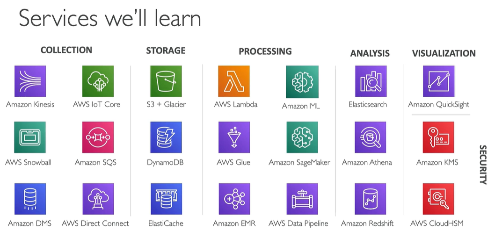
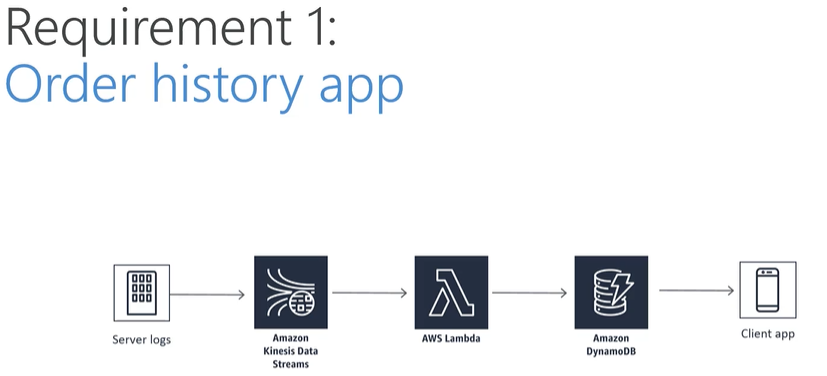
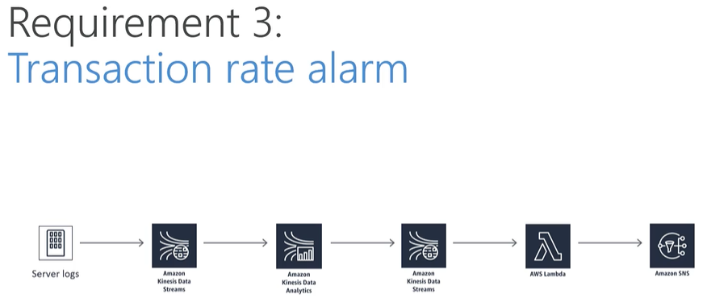
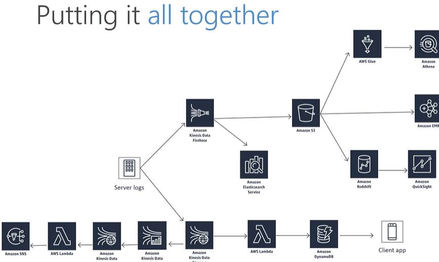

# DAS-C01 certification info

* aws certification info: [link](https://aws.amazon.com/certification/certified-data-analytics-specialty/?ch=tile&tile=getstarted)
* exam code: DAS-C01 (previously - big data specialty BDS-C00, very similar content, but included Machine Learning)
* challenging, very demanding
* recommended AWS basic knowledge (architect), analytics background, but other certification are not required (historical associate cert was required, but now it's not)

## What exam validates
* Define AWS data analytics services and understand how they integrate with each other
* explain how AWS data analytics services fit in the data lifecycle
  * collection
  * storage
  * processing
  * visualization

## Scope
* collection (18% of exam)
  * kinesis/sqs
* storage (22%)
  * s3
  * dynamodb
  * elasticache
* processing (24%)
  * lambda
  * glue
  * emr
  * data pipeline
* analysis and visualization (18%)
  * athena
  * redshift
  * quicksight  
* security (18%)

## Other Certification Info
* certification exam cost: 300USD
* exam length: 180 minutes, 65 questions
* minimum passing score 750 on scale from 100-1000 (like in all other AWS exams, all question are randomized and can have different level of difficulty - number of points depends on this level)

```info
there is additional 30 minutes of exam length for non-native speakers, you can get it by adding exam accomodation on exam registration page (https://www.certmetrics.com/amazon/candidate/exam_accommodations_default.aspx)
``` 

## Trainings 

### Udemy AWS Data Analytics 
* https://www.udemy.com/course/aws-data-analytics/learn/lecture/13891508#overview
* training materials: https://sundog-education.com/aws-certified-big-data-course-materials/

* Training Case Study
  * case study based on huge ecommerce called Cadabra
  * first requirement - orders generated, received by kinesis, processed by lambda and results stored in dynamo available for client app
  
  * second requirement - machine learning product recommendations, data received by kinesis firehose, stored in S3 and processed my emr
  * third requirement - transaction rate alarm, data received by kinesis, processed by lambda and sns notifies users
  
    * near-real-time log analysis (kinesis received data and visualized by elasticsearch service - Kabana)
    * warehouse - kinesis received data and stored them in S3, redshift and athena analyses data


### Cloud Guru AWS Certified Data Analytics Specialty 
* https://acloudguru.com/course/aws-certified-data-analytics-specialty
* course github repo: https://github.com/linuxacademy/Content-AWS-Certified-Data-Analytics---Speciality


