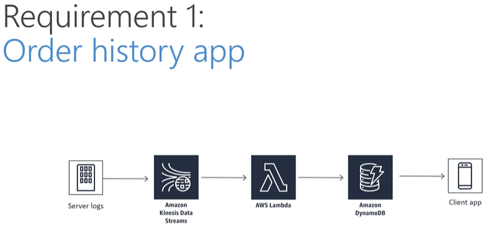
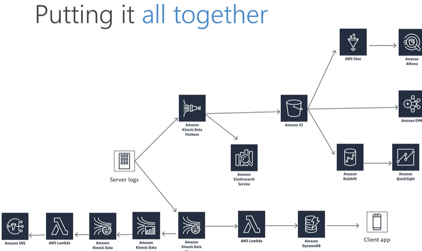

# Udemy Course Case Study 

* case study based on huge ecommerce called Cadabra
* first requirement - orders generated, received by kinesis, processed by lambda and results stored in dynamo available for client app

* second requirement - machine learning product recommendations, data received by kinesis firehose, stored in S3 and processed my emr
* third requirement - transaction rate alarm, data received by kinesis, processed by lambda and sns notifies users

* near-real-time log analysis (kinesis received data and visualized by elasticsearch service - Kabana)
* warehouse - kinesis received data and stored them in S3, redshift and athena analyses data

