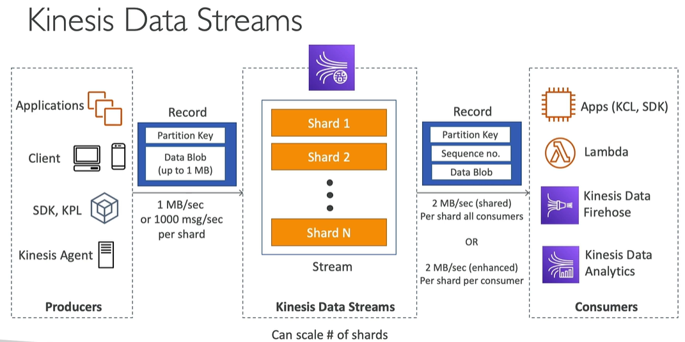

# Kinesis Data Streams
* required for processing stream data
* able to scale horizontally
* when creating data stream, number of shards has to be declared by creator. 
* By the number of shard you define consumption rate and ability to ingestion of big data (shards are used to split incoming data and create parallel processing)
* Kinesis Data Streams is a proprietary product developed by AWS and is not based on open-source Apache Kafka
 
## Producers
* data are created by producers
* producer can be an application, an other client, AWS SDK command or Kinesis Agent
* producer send **record** to Kinesis Stream
* **record** contain Partition Key and Data Blob (up to 1MB)
* partition key define which shard record will be send to
* one shard can ingest 1MB of data per second or 1000 messages per second (AWS limit, see more https://docs.aws.amazon.com/streams/latest/dev/service-sizes-and-limits.html)

## Consumers
* data ingested by shards of Kinesis Stream can be retrieved by other application - called Consumer
* consumer can be an application, AWS Lambda (by event), Kinesis Data Firehose or Kinesis Data Analytics
* additionally to record created by producer, consumer see **sequence number** field which describe the position of record within shard
* there are two types of limits for consumers
  * 2MB/sec per shard for **all** consumers
  * 2MB/sec per shard **per** consumer - if you enable **enhanced consumer mode**

## Kinesis Data Stream - properties/characteristics
* has **retention**, which can be defined by stream creator - can be from 1 to 365 days
* ability to reprocess data (based on retention mentioned in line above)
* data in stream are **immutable** (cannot be changed)
* records with the same partition key goes to the same shard

## Kinesis Data Stream - capacity modes
* provisioned mode (older)
  * you need to manually declare number of shards for created Kinesis Stream
  * each shard is limited by AWS limits (shard consumer 1MB/sec or 1000 messages/sec, shard producers 2MB/sec)
  * costs are calculated by number of shards provisioned by hour

* on-demand mode (newer)
  * capacity is declared automatically
  * default capacity = 4MB/s or 4000 records per second per shard
  * maximum capacity = 200MB/s and 200000 records per second
  * scales automatically based on throughput peak during the last 30 days
  * costs are calculated based on number of streams and data transfered in and out of the stream
  * if you don't know size of events

### Security
* Kinesis Shards are created within your account and region
* shards can be connected from private subnet using VPC endpoint
* shards can be connected from public subnet using the internet
* transfer of data is encrypted using HTTPS
* data are encrypted at rest using KMS