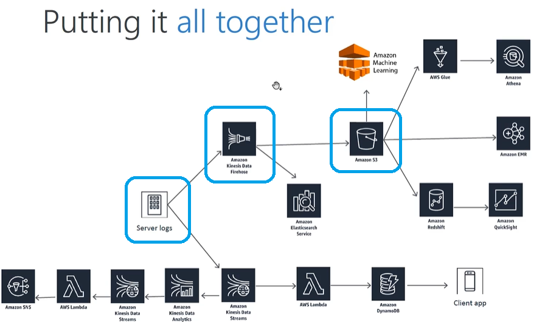
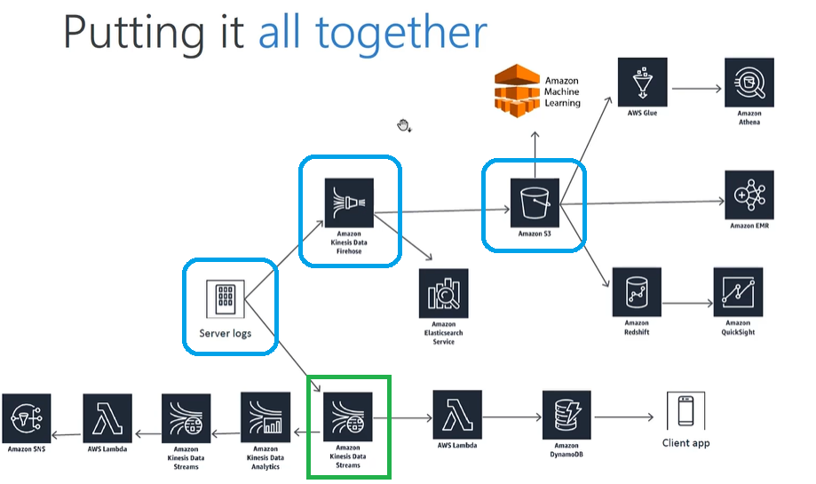

# Example with Kinesis Data Firehose

1. Create Kinesis Firehose for retrieving data and storing them onto S3 bucket each 60 seeconds or 5MB of buffer size
2. create ec2 instance, install on them aws-kinesis-agent which will be connected to firehose created in previous step
   1. install kinesis agent - `sudo yum install aws-kinesis-agent`
   2. in this example srcipt created by frank kane is used - it puts csv line into logs (/var/log/cadabra) (download from http://media.sundog-soft.com/AWSBigData/LogGenerator.zip)
   3. unzip downloaded file
   4. change permissions - `chmod a+x LogGenerator.py`
   5. create target log directory - `mkdir /var/log/cadabra`
   6. configure kinesis agent - `vim /etc/aws-kinesis/agent.json`
      1. here you can configure target kinesis or firehose endpoint (firehose.{region}.amazonaws.com)
      2. you can add specific credentials by using keys `awsAccessKeyId` and `awsSecretAccessKey`, but it's not the best one solution from security point of view. The best option is to create ec2 role with specific permissions and add them to running ec2 instance.
      3. define flows - what is the file pattern which will be followed and what is target stream/firehose name
   7. start kinesis agent service (`sudo service aws-kinesis-agent start` or `sudo chkconfig aws-kinesis-agent on` to autostart service on startup)
   8. kinesis agent store own logs in `/var/log/aws-kinesis-agent/aws-kinesis-agent.log`

# Example with Kinesis Data Stream

process is almost the same, the only changes are:
1. Kinesis Agent config - added dataProcessingOptions to convert csv to json
2. change target kinesisStream name to stream name
3. Kinesis Agent config - added flow, so we have two flows - one to put data into firehose and second to put data to stream
