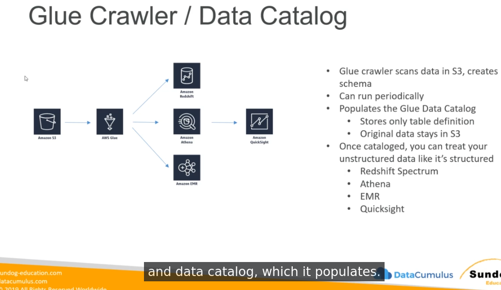
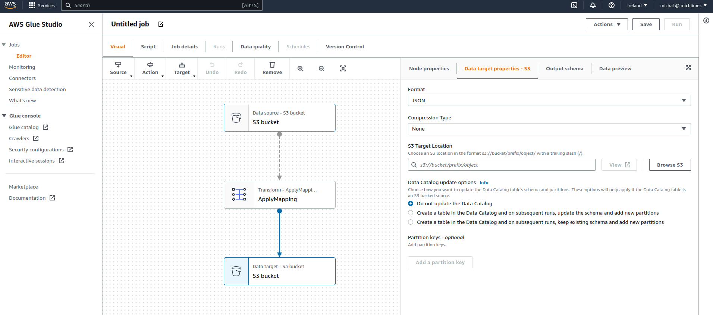
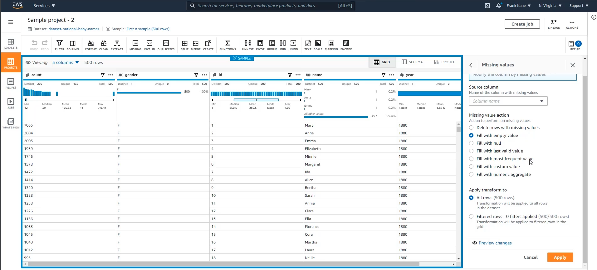

# AWS Glue
Serverless system used as a central metadata and schema repository for datalake.

The purpose is to extract structure (schema) from unstructured data and serve extracted structure as a schema for other tools - Athena, Redshift, EMR.
So in other way - if you have unstructured data, glue allow you to query those data using structured query language (SQL)

The other thing Glue does is custom ETL jobs (using Apache Spark under the hood) - Glue can process schema using event driven processes or schedules.

## Available data sources
* S3
* DynamoDB
* RDS
* Redshift
* Database on EC2
* on-premises databases using JDBC connection
* DocumentDB/mongoDB

## Glue Data Catalog
* persistent metadata store (similar to Apache Hive metastore)
* centralized repository - there is only one data catalog per AWS region
* beside schema you can have custom properties describing your table
* provides comprehensive audit - you can track schema changes and data access control in one place
  
## Glue Crawler
* crawler scans data in S3, creates schema automatically
* can be run periodically or on demand (manually), cron expression can be used to define schedule
* populates Data Catalog with tables and partitions
* data are not copied, stays in their places on S3, just schema is added on them in Glue Data Catalog
* crawler get access to source data by using proper IAM role (each crawler can be run using different IAM role)

## AWS Glue partitions
* Crawler can extract partitions based on how data is organized in S3
* you need to think about how you will be querying datalake and implement this hierarchy/structure in your s3 location
* partitions should be ordered from the most often queried to less often queried, because by using partitions it will limit amount of data which has to be scanned by bigdata tools

## Glue and Hive
Hive can query AWS Glue databases and their schemas - you can use HiveQL (similar language to SQL) to query data crawled into AWS Glue metastore.

You can also import hive metadata store into AWS Glue. 

## AWS Glue Studio (ETL, jobs)
* automatically generate code for interfaces created by user to transform data
* before Glue Studio introduction, user had to write his custom code based on boilerplate shared by AWS (Glue Studio allows for creating jobs using graphic interface)
* uses Scala or Python and run generated code in Apache Spark (uses custom AWS code - `awsglue` library)
* you can provide your own Apache Spark code (scala or python)
* handles encryption
* can be event driven (so you can have processes which are started automatically after certain change in your AWS account is made)
* can provision additional "DPU's" (data procesisng units) when builtin aws glue etl efficiency is not enough
* errors are reported directly to cloudwatch
* targets can be S3, JDBC (RDS, Redshift) or Glue Data Catalog (create table in glue metastore)
* fully managed, cost-effective (pay only for the resources consumed)
* apache spark platform used in etl jobs is serverless
* job created in AWS Glue Studio is under the hood json file - so you can store it outside in version control (there is also option of Version Control directly in AWS Glue Studio)
* in 2022 AWS added Data Quality steps which allows you to implement Data Quality inside jobs

### Workers setup / Data Processing Units (DPU's)
* you can use worker type standard, G.1X for memory intensive jobs or G.2X for jobs with ML transforms
* you can define number of workers (DPU) you want to use in this job (default=10)
* minimum DPUs for Spark and Spark Streaming job is 2, for python shell is 1 or 0.625
* maximum DPUs for Spark and Spark Streaming is 100, python shell if 1
* running more DPU should lead to faster processing
* cost per DPU is region dependent, but 0.44$/hour/DPU is the most common
* depend on AWS Glue Job version, pricing model is different (AWS Glue version 2.0 is billed on a 1-second increments with a 1-minute minimum, while AWS Glue 1.0 and 0.9 billed on 1-minute increments with a 10-minute minimum)
* you can use cloudwatch metrics to determine under or over provisioned DPUs in the cluster

### Dynamic Frame
basic object used in glue studio etl jobs - it's a spark dataframe with additional etl functions which expands default functionality of dataframe

in simillar way as spark dataframe contains many datarows, dynamicframe contains one or mode `DynamicRecord`. Each dynamic record contains fields/columns.

### Available Transformations
* bundled transformations: 
  * DropFields, DropNullFields
  * Filter (filtering records based on function) 
  * Join
  * Map (add custom fields, add calculated fields, perform external lookups)
  * ResolveChoice (resolve ambiguities in dataframe - when more than one column has the same name)
    * make_cols - creates a new column for each data type
    * cast
    * make_struct
    * project
  * machine learning transformations
    * FindMatchesML - identify duplicate or matching records in dataset (based on fuzzy similarity)
  * format conversions
    * CSV, Json, Avro, Parquet, ORC, XML
  * any other apache spark transformations (including Spark MLLib transformations)

### AWS Glue Data Catalog modify
it is possible to update Glue Metastore based on glue etl jobs:
* to add new partitions, you rerun glue crawler or enable option Data Catalog update options to do this automatically based on data in job run
* to update table schema, you rerun glue crawler or enable option Data Catalog update options to do this automatically based on data in job run
* to create new table - enable option Data Catalog update options to do this automatically based on data in job run

you can do all of those operations inside your etl job code (custom code required)

Restrictions:
* tables data must be located on S3 only
* json, csv, avro and parquet only
* parquet requires special code
* nested schemas are not supported

### Development Endpoints
* allows for develop etl scripts using notebook environements, but it looks like engine only, you need to have client which can connect to this instance.

### Running Glue jobs
* time-based schedules (like any cron style runs)
* Job bookmarks
  * used to persist state from the job run
  * allows for running job for increment processing
  * prevents from reprocessing of old data
  * only handles new rows, not updated rows, new objects in S3 not old objects etc
  * job bookmark can be:
    * enabled - process only new objects
    * disabled - (default), allways process entire dataset
    * pause - processing objects processed in job runs marked by `from-value` and `to-value` parameters (effectively - to not process new objects) 
* CloudWatch events
  * you can fire lambda function or sns notification when ETL succeeds or fails
  * invoke ec2 run, send event to kinesis, run Step Functions

## Pricing model
You pay for:
* Glue Data Catalog - for number of objects and access to the Glue Data Catalog (first million is free)
* Glue ETL Jobs - for the time it takes to run your Glue ETL Jobs (based on DPUs which are in some way multiplication of power of node and time consumed by node). Billed by the second
* Glue Developement Endpoints - same as for etl jobs - payed for DPU used by number of time, minimum billing duration is 10 minutes. Billed by minute.
* Glue Triggers - 
* Glue Crawlers - similar to etl jobs, pay for DPU and duration of crawling data. 

## Antipatterns
* if you need to use other engines than Spark (use Data Pipeline or EMR)
* before 2020 streaming was antipattern, but since April 2020 Glue started support streaming ETL by using APache Spark Structured Streaming

## AWS Glue New functionalities
below functionality have been introduced in 2020 or newer years, so it may be they wont be present on the exam

### AWS Glue Studio
* visual interface for etl workflows
* visual job editor
* create DAG's for complex workflows
* more option for sources and targets
* have visual job overviews, status and run times analysis
* allows also for monitoring jobs in a graphical dashboard

### AWS Glue DataBrew
* user interface for pre-processing large datasets
* input from s3, warehouse (redshift) or database, output to S3 only
* contains over 250 ready-made transformations
* it more simple than glue studio - it allows for very simple transformation (declare source, choose transformation from transformation set and declare target)
* contains projects within which jobs are stored with one or more transformations
* security
  * can integrate with KMS
  * SSL in transit
  * IAM restricts authorization (who can what)
* costs are calculated based on number of session (1USD/each session). Jobs costs are calculated similar to AWS interactive sessions (per node hour)
* interface looks similar to Microsoft PowerQuery
* you can use it as a tool (implement steps and download processed data in csv file) or you can create ETL DataBrew job based on what you've created in the tool

### AWS Glue Elastic Views
* materialized views on data based from Aurora/RDS/DynamoDB/Redshift

### AWS Lake Formation
* built on top of Glue
* "makes it easy to set up a secure data lake in days"
* it's a blueprint/automated option to do everything connected to data lake in one service
* doesn't cost anything, only services used under the hood are paid

