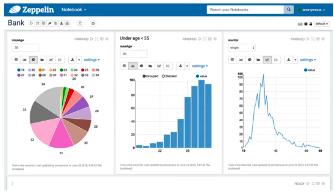

# Apache Spark
Open Source distributed framework used for big data workloads.

* kind of replacement for Map Reduce architecture - instead of Map Reduce which uses storage, Spark uses RAM memory (this is why it is faster)
* contains predefined transformations, additional libraries (Spark MLlib, Spark Structure Streaming, Graph Processing etc) which help users in faster development of big data distributed applications
* by using catalyst optimizer improves efficiency and is able to automate some processes which requires proper order of operations
* programming languages supported: Java, Scala, Python and R
* you can use it in interactive session and for batch processing or stream processing
* Spark is not meant for OLTP (it doesnt support transactions, it has overhead on starting application etc.)

## Architecture
* driver node, Spark Context - coordinator, manages executor nodes by using YARN. All applications are send to this node
* executor node - run computations and store data, receives command from driver node, executes them and send back results to driver

## Components
* Spark Core - foundation of platform, responsible for memory management, scheduling, distribute&monitor jobs, interact with storage, uses RDD for processing data
* Spark SQL - best suitable for batch processing, distributed query engine, uses distriibuted DataFrames for processing data
* Spark Structured Streaming - streaming analytics, support real time straming, users can use the same code as in spark sql, supports Kafka, Flume, HDFS
* Spark MLLib - support machine learning algorithms
* Graphx - graph processing

## Integrations
* S3 - can be source or target for Spark applications
* Kinesis - you can read data from kinesis stream and do stream processing on this (e.g. compute number of records send to stream within one hour)
* Redshift - you can both read and store data into Redshift (separate library containing Spark Redshift connector)

# Apache Hive
distributed query engine allowing users to use sql on unstructured data. It uses mapreduce or tez (in-memory).

* uses HiveQL which is very similar to sql language
* allows for interactive query (still not as fast os OLTP databases)
* in some way, it replaces manually written map-reduce functions and allows user to simply use sql queries
* it's horizontally scalable like any other application sitting on EMR cluster (hadoop cluster)
* high extensible (user defined functions, exposes data via jdbc and odbc driver)

## Hive Metastore
* schema metadata collection on which Hive executes queries
* contains definition of fields and datatypes
* by default, hive metastore is stored in mysql database on the master node
* still can have external metastore - AWS Glue Data Catalog or store hive metastore in Amazon RDS (as it is AWS functionality for RDBS service, this way your hive metastore is persistent and doesn't dissapear when cluster is terminated)
* serves the same functionality as AWS Glue Data Catalog

# Pig
introduces pig latin, scripting language let use sql-like syntax instead of writing mappers and reducers by hand.
Still, it's not a SQL, it it a script language.

Mostly used for processing data.

Quite old technology, not popular nowadays.

Highly extensible with user-defined functions (UDFs)

It works on top of MapReduce or Tez.

It is not limited just to HDFS, it can query data in S3. Can load srcripts from S3.

# HBase
* non-relational, petabyte-scale database.
* based on Google BigTable, works on top of HDFS.
* it operates mostly in-memory (this is the main reason why it's so fast)
* it's similar to dynamodb
  * both are nosql databases
  * but dynamodb is fully managed and have native integration with other AWS services
  * hbase is better for sparse data (columnal store?) and for high write&update throughput
* integrates with S3 via EMRFS

# Presto
connects to many different datasources and exposes them as one datasource (it can read data from hive and exposes it)

* unifies all data in one metastore
* allows for interactive queries at petabyte scale
* has familiar SQL syntax
* optimized for OLAP applications
* Amazon Athena uses Presto under the hood
* exposes jdbc, command line and tableau interfaces
* has own query optimizer (CBO)
* in open-source world, it has renamed to Trino after facebook claimed ownership for Presto name
* possible source of data:
  * HDFS
  * S3
  * Cassandra
  * MongoDB
  * HBase
  * SQL
  * Redshift
  * Teradata
* it is even faster than Hive
* all processing is done in-memory (but still not appropriate for OLTP)

# Zepellin
* requires hadoop/EMR cluster
* similar to Jupyter Notebooks, but a little bit different
* let interactively run scripts/code against data
* share notebooks with others on cluster
* can run Spark code interactively
* can visualize query results in charts and graphs

# EMR Notebooks
* similar to apache zeppelin
* allow for provision cluters from the notebook
* hosted inside a VPC
* accessed only via AWS console
* costs charged on EC2 instances launched under the hood, no additional charge for jupyter

# Hue
* HUE = Hadoop User Experience, frontend for entire cluster
* open-source SQL assistant, self service data querying
* integrates with IAM roles (secruity/authorization)
* can browse & move data between HFDS and S3

# Splunk
* visualize EMR and S3 data using EMR Hadoop cluster

# Flume
* streams data into cluster
* made from the start with hadoop in mind
* originally madde to handle log aggregation
* has similar usage as kinesis (streaming log data into cluster)

# MXNet
* alternative to tensorflow, library for neural networks, included on EMR