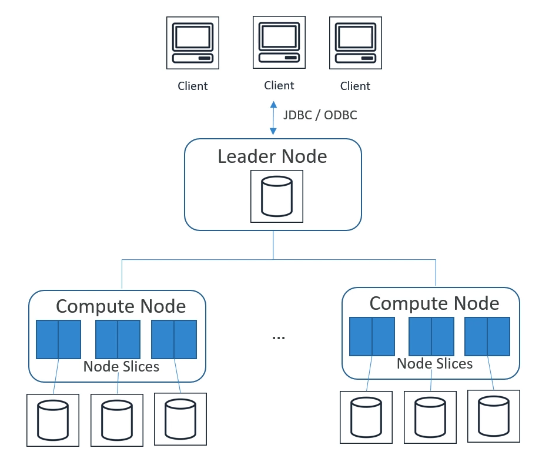

# Amazon Redshift

## What is it
Fully-managed, petabyte-scale data warehouse.

* 10-times better performance than other Data Warehouses
  * massive parallel query execution
  * columnar storage
* designed for **OLAP** not OLTP
* cost effective (no upfront costs, pay as you go)
* SQL, ODBC/JDBC interfaces
* scale up or down on demand
* builtin replication & backups
* monitored via Cloudwatch/Cloudtrail
* based on Postgres, expanded by AWS

## Use cases
* accelerate analytics workloads
* unified data warehouse & data lake (by Redshift Spectrum)
* data warehouse modernization 
* analyze global sales data, store historical stock trade data
* analyze other data - ad impressions/clicks/gamin data/social trends

## Architecture
* redshift aggregates all objects into cluster
* cluster contains nodes:
  * leader node - managing communication between clients and compute nodes (so clients send requests to leader node only)
    * receives client requests
    * parses requests
    * develops execution plans
    * coordinates parallel execution of developed plan
    * return results to client
  * compute node(s) - one or more
    * executing commands/steps received from leader node
    * transmitting data between compute nodes to serve queries
    * sends intermediate results to leader node
    * cluster can contain up to 128 compute nodes and one leader node (so it's not "infinetely scalable")
    * compute nodes can be one of below types:
      * dense storage node = allows for very large warehouses and uses HDDs (low price, lower performance), available two versions with 2TB and 16TB of storage and different number of vCPU and RAM
      * dense compute node = allows for very high performance nodes (SSD)
    * every compute node is divided into slices
      * portion of each node CPU and memory is allocated to each slice
      * number of slices per node is determined by node size
      * queries executed by node are splitted into slices to have more parallel processing

## Spectrum
* allows to query exabytes of unstructured data in S3 without loading
* do the same type of work like Athena does with AWS Glue Datacatalog (so it can be treated as replacement for Presto)
* limitless concurrency
* horizontal scaling
* responsible only for computing (storage is S3)
* wide variety of data formats (avro, csv, orc, text files, tsv, parquet and any other popular opensource formats)
* support for Gzip and Snappy compression

## Performance
redshift is fast because of three aspects:
* massively parallel processing (MPP)
* columnar data storage (splitable)
* column compression (thanks to columnar data storage repeatable data in column need less space)

## Durability
* replication within cluster
* data continuously backed up to S3
* in effect data are stored in 3 different places: original, replica and S3  
* automatic replace failed drives/nodes
* however - cluster is limited to a single AZ (in november 22 AWS announced multi-az support for cluters which are in AWS preview)

## Scaling
* supports both vertical and horizontal scaling
* scaling is done in specific way:
  * new cluter is created while old one remains available for reads
  * CNAME is moved from old to new cluster (which results in few minutes of downtime, done during some sort of maintenance window)
  * then redshift move data from old cluster to new cluster in parallel way

## Distribution Styles
When data is loaded to table, redshift is distributing data across the compute nodes and slices according to the distribution style defined when creating the table.

The main aim of data distribution is to distribute workload among the nodes and to minimize data movement during query execution.

There are four distribution styles:
* AUTO - default, based on the size of the table redshift assign optimal distribution for user. If can be EVEN, KEY or ALL
* EVEN - regardless of the record value, all records are divided into nodes and slices evenly (round robin). Best solution when table is not joined with other table or when it's difficult to decide between KEY and ALL distribution styles.
* KEY - rows distributed based on values of one column, the best when most queries are requested with filter on one column
* ALL - entire table is copied to all nodes. It multiplies storage, insert or updates in tables with this distribution styles lasts longer than other, best solution when table is often joined with other table (because all data are present in current node/slice). Appropriate only for slow moving tables.

## Sort Keys
Similar to indexes in RDBS - Redshift stores values of selected field in order, therefore this can reduce number of disk scans when range filtering is required for query.

The best sort key is a field which is often used in WHERE clauses (i.e. when most recent queries are important, it will be helpful when sort key will be a field with timestamp). Also helpful is to define sort key when field is part of joins, but in this case more important is to specify this field as a distribution key.

Types of sort key:
* single - one field, useful when only one field is used in filtering or joins
* compound - default, **all fields**, order of fields are important (index is build in this way). Performance will be lower when only second field is used in filtering, without the first one.
* interleaved - all fields, of which all are equally important (so fields order is not important)

## Data Flows
### Import data
Most efficient method to import data into Redshift table is `COPY` command.

* parallelized
* can read data from S3, EMR, DynamoDB or remote hosts (using SSH)
* COPY command include table name, source of data (or Manifest file containing sources of data), authorization
* authorization can be IAM role or key-secret (this is included in COPY command)
* COPY can decrypt data as it is loaded from S3
* compression is supported to speed up (gzip, lzop and bzip2)
* automatic compression at target is possible - redshift can decide what is the best option for storing data on cluster
* narrow tables (lots of rows, few columns) should be done by one and only one COPY command (due to overhead of hidden metadata columns which consumes too much space)

`COPY` is used for importing external data only, in case when user want to import data from other Redshift table he should use `INSERT INTO...SELECT` or `CREATE TABLE AS...` commands

### Export data
Most efficient method is `UNLOAD` command, it allows to unload table to objects stored in S3 bucket.

### Enhanced VPC routing
By default, all COPY and UNLOAD communication is done using Internet, you can change it to communication through Amazon VPC. In such case, you need to configure VPC correctly.

### DBLink
* allows to connect redshift to PostgreSQL (possibly in AWS RDS)
* solution for copy and sync data between postgresql and redshift

## Integration with other AWS services
* S3 - parallel export from Redshift to multiple data files on S3, import data from S3 using COPY or use S3 objects by using Redshift Spectrum. 
* DynamoDB - can import data from dynamodb using `COPY` command
* EMR/EC2 - import data using `COPY` and SSH connection
* Data Pipeline - redhisft tables can be used in data pipelines
* AWS DMS (Database Migration Service) - can migrate database from existing Data Warehouse to Redshift

## Workload Management (WLM)
way to help users prioritize workloads

* prioritize short, fast queries vs long, slow queries (prevent from stucking short queries in queue waiting for long queries)
* uses query queues to achieve this
* you can modify WLM using console, CLI or API

### Automatic Workload Management
By default, creates up to 8 queues, default 5 queues with even memory allocation. 

For large queries concurrency is lowered, for small queries - raised.

Each queue can be configured separately.

### Manual Workload Management
Creates one queue with concurrency level of 5 (5 queries at once) and additional superuser queue with concurrency level 1.

You can define up to 8 queues, up to concurrency level 50.

### Short Query Acceleration (SQA)
prioritize short running queries over longer-running once, uses machine learning to predict a query's execution time.

It's alternative to WLM.

## Vacuum
Used to recover space from deleted rows and to restore the sort order.

Typs of vacuum:
* FULL - default, re-sort rows and reclaim space from deleted rows
* DELETE ONLY - like full but without re-sorting rows 
* SORT ONLY - like full but without reclaiming space
* REINDEX - used for reinitializing interleaved indexes

## Scaling
### Concurrency scalling
automatically adds cluster capacity to handle increase in concurrent read queries

You can choose which queries take advantage of this feature, as it obviously not cheap.

### Elastic resize
* quickly add or remove nodes of same type
* cluster is unavailable only for few minutes, but tries to keep connections open during the downtime and resume them after capacity is added to cluster
* for some dc2 and ra3 node types you can only double of halve number of instances

### Classic resize
* can add nodes of other type
* cluster is read-only for **hours to days**

### (workaround) Snapshot, restore, resize
* strategy for keeping cluster available during classic resize
* you can do snapshot of old cluster, create a new cluster as you require and restore snapshot to newly created cluster

## Features introduced after 2020
### RA3 nodes
* enable independent scaling of compute and storage
* SSD based

### Datalake export
* allows for unloading redshift query to S3 in Apache Parquet format

### Spatial data types
* GEOMETRY
* GEOGRAPHY

### Cross-Region data sharing
* share live data across Redshift clu\ters without copying
* requires RA3 node types

### AQUA - Advanced Query Accelerator
layer between redshift cluster and S3.

Available only on ra3 nodes.

pushes reduction and aggregation queries closer to the data.

### Redshift Serverless
* Automatically scaling and provisioning for workload
* pay only when in use, optimizes costs & performance
* uses ML to manage performance
* as it is serverless, starting work with redshift is very easy
* perfect for easy ad-hoc business analysis
* jdbc/odbc connection is available
* capacity measured in Redshift Processing Units (RPU's)
  * costs calculated for RPU-hours (per second) plus storage in GB
  * there is base rpu's, you can adjust it from 32 to 512 RPU's, by default it's AUTO
  * you can define Max RPU's

#### Limitations
* spectrum is not supported
* workload management doesn't work (obvious as it is serverless)
* maintenance windows - not supported, you dont know when updates will be applied
* no public endpoints (yet) - must access within VPC

  ## Security
* access permissions are granted or revoked as simply as in every postgresql - by `GRANT` or `REVOKE` command

## Antipatterns
* Small datasets - use RDS instead
* OLTP - use RDS or DynamoDB
* unstructured data - do ETL using EMR first (on the other hand - still can use Spectrum for such data)
* BLOB data (store them in S3 and store only reference in redshift)